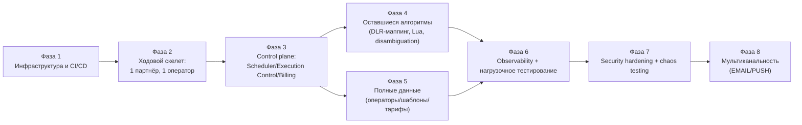

# MPP — план дальнейшей разработки

**Контекст на момент написания:** архитектура и LLD в основном закрыты — 6 базовых документов (`hld.md`, `services_specifictaion.md`, `service_io_contracts.md`, `service_internal_methods.md`, `data_infrastructure_spec.md`, `capacity_model.md`), протоколы (`platform-contracts/`), DDL-миграции (`migrations/`), три state machine (`state_machines/`), 9 JSON Schema конфигов (`config_schemas/`), Policy Engine matching+оркестрация (`policy_matching/`), Kubernetes-манифесты и NetworkPolicy (`k8s/`) — всё с исполняемыми тестами, не только описанием. Это план о том, что нужно, чтобы из LLD на бумаге получилась работающая система, а не каталог оставшихся идей.

## Как читать этот план

Работа сгруппирована в 8 фаз. Фазы **не строго последовательны** — внутри каждой фазы задачи можно вести параллельно, но фаза N+1 предполагает, что блокирующие пункты фазы N закрыты (см. колонку "Блокирует" в каждой таблице). Фазы 4 и 5 можно вести полностью параллельно — они не зависят друг от друга.

**Работа над Фазой 2+ идёт двумя параллельными агентами** — см. "Распределение между агентами" сразу после этого раздела: кто какие сервисы реализует, границы файлов, и реальные технические ловушки (Docker/PostgreSQL/Kafka), с которыми уже столкнулся Главный агент — прочитать перед стартом, чтобы не наступать повторно.

---

## Распределение между агентами (Главный агент / Субагент 1)

Два агента работают параллельно над одним деревом файлов. Разбивка ниже построена так, чтобы у каждого агента была **своя директория `services/<name>/`** — по конструкции без пересечений на уровне файлов. Сервисы сгруппированы не произвольно: **Главный агент** держит "ходовой скелет" — путь одного сообщения от приёма до нотификации партнёра (Фаза 2.4) плюс всё, что уже проектировал в LLD этой сессии (Policy matching, Billing account_state, Message Lifecycle state machine) — держать реализацию рядом с уже написанным дизайном логичнее, чем передавать другому агенту без контекста. **Субагент 1** держит весь control plane и operator-facing периметр — эти сервисы не блокируют Фазу 2.4 напрямую и могут строиться полностью независимо.

### Кто что реализует (Фаза 2.1, 32 сервиса)

**Главный агент — 11 сервисов** (10 + уже готовый `destination-resolution-service`):

| Сервис | Язык | Почему у Главного агента |
|---|---|---|
| `destination-resolution-service` | Rust | ✅ готов (10/10 тестов) |
| `policy-service` | Rust | ✅ готов (40/40 тестов, было 27 — 4 по итогам кодревью, 3 по итогам находки о секретах, 6 по итогам 4.3/4.4) — порт `policy_matching/` (template matching + banwords + оркестрация 8 проверок), 1:1 по тестам; исправлены UTF-8 паника в `parse_pattern` и сдвиг часового пояса (UTC вместо Asia/Tashkent) в `check_time_of_day`; реальная приоритизация шаблонов (4.3) и расширенная Cyrillic+Greek таблица гомоглифов (4.4) — см. `services/policy-service/README.md` |
| `billing-service` | Java | ✅ готов (37/37 тестов, было 21 — 6 по итогам кодревью, 4 по итогам находки о секретах, 6 по итогам Redis Lua/4.2) — порт `state_machines/billing_account_state.py` (fencing по account_epoch), 1:1 по тестам, первый Java-сервис сессии; исправлены 3 critical находки (offset-commit data loss, negative segment_count, TOCTOU race), `apply_atomic_charge` теперь настоящий атомарный Lua-скрипт — см. `services/billing-service/README.md` |
| `pipeline-engine` | Rust | ✅ готов (28/28 тестов, было 12 — 6 по итогам кодревью, 1 по итогам delivery-service, 9 по итогам Redis CAS/4.2) — центральный оркестратор, обходит весь граф из `pipeline.valid.json` от начала до конца, включая Billing-BLOCKED override; **многорепличный блокер снят** — `ExecutionState` теперь в Runtime Redis с реальным атомарным CAS (`cas_transition_and_track_deadline`, development_plan.md 4.2), не в памяти процесса — см. `services/pipeline-engine/README.md` |
| `partner-rest-receiver` | Rust | ✅ готов (62/62 тестов, было 59 — 3 по итогам находки о секретах) — точка входа "ходового скелета", единственный сервис серии, публикующий `incoming.messages` вместо потребления `stage.*`, реальный расчёт `segment_count` (GSM-7/UCS-2, GSM 03.38), см. `services/partner-rest-receiver/README.md` |
| `routing-service` | Rust | ✅ готов (10/10 тестов) — тесты грузят реальный `config_schemas/examples/routing_table.valid.json`, см. `services/routing-service/README.md` |
| `delivery-service` | Java | ✅ готов (30/30 тестов, было 26 — 4 по итогам находки о секретах) — первый сервис сессии, реально генерирующий и компилирующий gRPC-код (`OperatorSubmitService`), реальная GSM-7/UCS-2 сегментация на байтовом уровне, см. `services/delivery-service/README.md` |
| `dlr-correlation-writer` | Go | ✅ готов (18/18 тестов, было 15 — 3 по итогам находки о секретах; 3 реально против живой PostgreSQL) — первый Go-сервис Главного агента, нашёл и закрыл реальный пробел партиционирования `dlr_correlation`, см. `services/dlr-correlation-writer/README.md` |
| `dlr-manager` | Go | ✅ готов (26/26 тестов, 5 реально против живых Postgres/Redis) — закрыл открытый вопрос Субагента 1 про `operator.dlr.unresolved`, владелец 4.1 (DLR code mapping — базовый SMPP-словарь есть, расширение по операторам открыто), см. `services/dlr-manager/README.md` |
| `message-state-resolver` | Java (Kafka Streams) | ✅ готов (28/28 тестов) — порт `state_machines/message_lifecycle.py` 1:1, реальная транзакционная гарантия HLD §10.1 через настоящий transactional KafkaProducer, см. `services/message-state-resolver/README.md` |
| `partner-notification-service` | Go | ✅ готов (21/21 тестов, 13 реально против живых gRPC/HTTP серверов) — конец пути "ходового скелета", закрыл 2 открытых вопроса Субагента 1, см. `services/partner-notification-service/README.md` |

**Субагент 1 — 21 сервис:**

| Сервис | Язык | Группа |
|---|---|---|
| `partner-smpp-gateway` | Java | Operator/partner-facing протоколы |
| `operator-smpp-session-manager` | Java | Operator/partner-facing протоколы |
| `operator-http-gateway` | Go | Operator/partner-facing протоколы |
| `delivery-reconciliation-service` | Java | Operator/partner-facing протоколы |
| `scheduler-critical-sweep` | Go | Control plane (Фаза 3.2) |
| `scheduler-standard-lane` | Java (Kafka Streams) | Control plane (Фаза 3.2) |
| `scheduler-background-lane` | Java (Kafka Streams) | Control plane (Фаза 3.2) |
| `execution-control-service` | Go | Control plane (Фаза 3.1) |
| `configuration-service` | Go | Control plane |
| `config-event-publisher` | Go | Control plane |
| `config-cache-projector` | Go | Control plane |
| `consent-cache-projector` | Go | Control plane |
| `billing-outbox-publisher` | Java | Billing периметр (не hot-path `billing-service`) |
| `billing-ledger-writer` | Java | Billing периметр |
| `billing-reconciliation` | Java | Billing периметр (Фаза 3.3, freeze/unfreeze) |
| `partner-api` | Go | Backoffice/Partner API периметр |
| `backoffice-api` | Go | Backoffice/Partner API периметр (Фаза 3.4) |
| `backoffice-ui` | Vue3/TS | Backoffice/Partner API периметр (Фаза 3.4) |
| `replay-service` | Go | Backoffice/Partner API периметр |
| `lifecycle-writer` | Go | Writer-периметр |
| `analytics-writer` | Go | Writer-периметр |

### Фазы 3-4 — распределение по тому же принципу

| # | Задача | Владелец |
|---|---|---|
| 3.1 | Execution Control | Субагент 1 (владеет `execution-control-service`) |
| 3.2 | Scheduler (3 lane) | Субагент 1 |
| 3.3 | Billing Reconciliation freeze/unfreeze | Субагент 1 |
| 3.4 | Backoffice API/UI | Субагент 1 |
| 3.5 | Message State Resolver транзакционная гарантия | Главный агент |
| 4.1 | DLR code mapping | Главный агент (владеет `dlr-manager`) |
| 4.2 | ✅ Lua: Runtime Redis CAS+deadline И Billing Redis `apply_atomic_charge` — Главный агент (оба потребителя — `pipeline-engine`/`billing-service` — его) | `apply_atomic_charge.lua` (billing-service, 37/37 тестов, 6 живьём против Redis, включая 20-поточный конкурентный) + `cas_transition.lua`/`finalize.lua` (pipeline-engine, 28/28 тестов, 5 живьём против Redis) — оба закрыты, см. README каждого сервиса |
| 4.3 | ✅ Template disambiguation — Главный агент (`policy-service`) | Специфичность плейсхолдеров (Digit>Word) + длина литералов + insertion order tie-break, 40/40 тестов |
| 4.4 | ✅ Homoglyph-таблица — Главный агент (`policy-service`) | Расширена Cyrillic (+к/м) и Greek/Latin (α/ο/ι/κ/ν/ρ/υ/τ/χ) категориями, все — реальные записи из Unicode confusables.txt |

Фазы 5-8 не расписаны по агентам заранее — они начинаются после того, как соответствующий владелец закроет свою часть Фазы 2/3, назначаются по факту готовности, не резервируются заранее.

### Координация — обязательно прочитать перед началом

1. **Каждый сервис — своя директория `services/<name>/`, имя ровно как в `k8s/generate_manifests.py` SERVICES.** Ничего за пределами своей директории не трогать без явной необходимости.
2. **`development_plan.md`, `platform-contracts/*.proto`, `k8s/generate_manifests.py`, `infra/` — общие файлы.** Правки в них координирует Главный агент. Если Субагенту 1 нужно изменить прото-контракт или добавить секрет в `SECRET_DEPENDENCIES` — задокументировать потребность в README своего сервиса, не редактировать общий файл напрямую без синхронизации (репозиторий **не git**, конфликтующая параллельная запись в один файл ничем не защищена — см. риск ниже).
3. **Здоровье/готовность — обязательная конвенция для всех 32 сервисов, не только для скелета:** порт 9090, `/healthz` (всегда 200), `/readyz` (503 до готовности), `/metrics` (Prometheus exposition, минимум плейсхолдер-ответ 200) — см. `services/destination-resolution-service/src/health.rs` как референс. `k8s/generate_manifests.py` уже настроил readiness/liveness/PodMonitor на этот контракт для всех сервисов — расхождение сломает деплой молча.
4. **Секреты — не выдумывать заново.** `k8s/generate_manifests.py SECRET_DEPENDENCIES` уже определяет, какие из 5 secretRef (`postgresql`/`redis-runtime`/`redis-configuration`/`redis-billing`/`clickhouse`) получает каждый сервис через `envFrom` — переменные окружения уже названы (`POSTGRES_HOST`, `REDIS_RUNTIME_PASSWORD` и т.д., см. `infra/secrets/generate_external_secrets.py SECRET_KEYS`). Если сервису нужен секрет, которого там нет — это находка, не молчаливое решение, дописать в README.
5. **Docker/PostgreSQL/Kafka — реальные приколы этой сессии, разойдутся по независимым песочницам агентов:**
   - **Docker daemon недоступен в песочнице Главного агента всю сессию** (`docker run` для PostgreSQL упал с "Cannot connect to the Docker daemon" в самом начале). Обошли через `brew install postgresql@17` — реальный локальный PostgreSQL без контейнера (`migrations/README.md`). **У Субагента 1 песочница отдельная — Docker может оказаться доступен или недоступен независимо от опыта Главного агента, не считать одно окружение показателем для другого.** Если Docker недоступен — тот же обход (brew/локальный процесс) для любой БД/брокера, которые нужны для тестов.
   - **Unix socket path too long** — `initdb`/`pg_ctl` падали, если `PGDATA`/сокет лежат в длинном пути. Обход: короткий путь для сокета (`-k /tmp/...`), `PGDATA` может оставаться где угодно.
   - **Kafka никогда не поднимался и не тестировался live** ни для одного сервиса в этой сессии — ни через Docker (недоступен), ни через `kind`+Strimzi (не поднимался). Паттерн, который сработал для `destination-resolution-service`: бизнес-логика (`resolver.rs`, `handle_command` в `kafka_io.rs`) — чистые функции без сети, юнит-тестируются без брокера; Kafka-обвязка (`rdkafka`/консьюмер-луп) пишется по-настоящему (компилируется, использует реальные типы клиента), но интеграционно не проверяется в этой среде. **Следовать тому же паттерну**, не пытаться поднять живой Kafka, если у Субагента 1 та же недоступность Docker.
   - **`brew install terraform` не работает** — HashiCorp убрал Terraform из homebrew-core из-за смены лицензии, нужен `brew install hashicorp/tap/terraform`. Не относится напрямую к сервисам, но если Субагент 1 трогает `infra/` — та же ловушка.
   - **librdkafka — через `brew install librdkafka` + линковка через pkg-config** (`PKG_CONFIG_PATH=/opt/homebrew/opt/librdkafka/lib/pkgconfig`), не cmake-build vendored (компилируется на порядок дольше). Актуально для любого Rust/C-based Kafka-клиента; для Java (`kafka-clients` — чистая Java, JVM) и Go (`franz-go`/`confluent-kafka-go` — franz-go чистый Go без cgo, предпочтителен по этой же причине) эта конкретная проблема не возникает.
6. **Рекомендация, не блокирующая старт:** сейчас репозиторий не под git (`is_git_repo: false`) — два агента, пишущих в одно дерево файлов без версионирования, ничем не защищены от гонки на общих файлах (п. 2 выше). `git init` в корне репозитория — безопасная, обратимая, чисто локальная операция, которая дала бы по крайней мере историю и возможность увидеть/откатить конфликт. Решение — за пользователем, оба агента должны исходить из того, что его может не быть, и придерживаться границ директорий строго.

---

## Фаза 1 — Инфраструктура и CI/CD

Ничего из уже сгенерированных `k8s/`-манифестов не задеплоится сам по себе — они предполагают кластер, registry, Kafka, 3 Redis-кластера, PostgreSQL, ClickHouse и секреты, которых пока не существует. Эта фаза — предпосылка для всего остального.

| # | Задача | Статус | Примечание |
|---|---|---|---|
| 1.1 | IaC для кластера (Terraform): node pools отдельно под `sticky-statefulset` (локальный SSD под RocksDB для kafka-streams-класса) и под остальные классы | ✅ закрыто | `infra/terraform/k8s-cluster.tf` — 4 node group по `mpp.io/workload-class`, `terraform validate` чисто против реальной схемы yandex-cloud провайдера. Провайдер — Yandex Cloud, решение пользователя (см. `infra/README.md`) |
| 1.2 | Kafka-кластер: сколько партиций на топик, replication factor, retention per topic | ✅ закрыто | `infra/kafka/generate_kafka_topics.py` — партиции вычислены из `replicas_for()` (та же функция, что и в `k8s/`), не выдуманы; self-hosted через Strimzi (решение пользователя). Найден и учтён co-partitioning инвариант `stage.completed`/`delivery.status` (Kafka Streams join) |
| 1.3 | 3 Redis-кластера (Runtime / Configuration / Billing) — sizing, persistence (AOF обязателен для Billing, `hld.md` §15), Sentinel/Cluster режим | ✅ закрыто | `infra/terraform/redis.tf` — 3 отдельных `yandex_mdb_redis_cluster`, `persistence_mode=ON` только для Runtime/Billing |
| 1.4 | PostgreSQL — HA (primary+replica), backup/restore, к какому Redis финансовый ledger привязан | ✅ закрыто (HA-топология) | `infra/terraform/postgresql.tf` — 3 хоста; backup/restore-процедура как runbook — ещё нет (Фаза 6) |
| 1.5 | ClickHouse — под Analytics Writer/Partner API/Backoffice API | ✅ закрыто | `infra/terraform/clickhouse.tf` (`_v2` — провайдер пометил обычный ресурс deprecated) |
| 1.6 | Container registry + CI pipeline (build/scan/sign/push), тегирование (semver или git-sha) | 🟡 частично | `infra/terraform/registry.tf` (registry + per-service repo) и `.github/workflows/ci.yml` готовы — но CI пока только **валидирует** (protoc/миграции/тесты/kubeconform/terraform), не строит и не пушит образы; тегирование не выбрано |
| 1.7 | Secrets (Vault + External Secrets Operator) — DB DSN, Redis-пароли (x3), ClickHouse | ✅ закрыто (SMPP bind-креды и Kafka SASL — нет, см. ниже) | `infra/secrets/generate_external_secrets.py` (ClusterSecretStore + 5 ExternalSecret) + `infra/terraform/vault.tf`/`vault-secrets.tf` (self-hosted Vault, standalone/file-storage — не HA). Заодно закрыт скрытый пробел: ни один сервис раньше не имел `envFrom` вообще — добавлено `Service.secrets`/`SECRET_DEPENDENCIES` в `k8s/generate_manifests.py` |
| 1.8 | **Решение по mTLS** | ✅ закрыто | Istio, решение пользователя. `infra/terraform/istio.tf` (helm_release base+istiod) + `infra/istio/peer-authentication-strict.yaml` (PeerAuthentication STRICT + DestinationRule). `k8s/generate_manifests.py` — namespace `mpp` теперь несёт `istio-injection: enabled` |
| 1.9 | Ingress-контроллер + cert-manager + реальные домены | ✅ закрыто (кроме покупки реального домена — `EXTERNAL_DOMAIN="mpp.example"` плейсхолдер) | `infra/terraform/ingress.tf` (ingress-nginx + cert-manager helm_release) + `infra/ingress/cluster-issuer.yaml` (Let's Encrypt HTTP-01). Только 4 из 6 внешних сервисов — `k8s/generate_manifests.py build_ingress()`; Partner SMPP Gateway (raw TCP) и Operator HTTP Gateway (sticky, свой LoadBalancer) через Ingress не идут — обосновано в `infra/README.md` |
| 1.10 | KEDA-оператор + Prometheus-оператор + Grafana | ✅ закрыто (без alerting rules/дашбордов — намеренно, Фаза 6) | `infra/terraform/observability.tf` (KEDA + kube-prometheus-stack helm_release) + `infra/observability/pod-monitor.yaml` (один PodMonitor на весь namespace). Найдена и исправлена нестыковка: `k8s/network_policies.py`'s `allow-prometheus-scrape-ingress` ожидал `app=prometheus`, реальный chart не гарантирует этот лейбл — подогнано явным `podMetadata.labels` в helm values |

**Фаза 1 закрыта полностью (10/10).** Открытый технический долг — см. "Известный технический долг" и "Фаза 1 — итог" в `infra/README.md` (дублирование списка сервисов между `k8s/` и `infra/terraform/registry.tf`, `yc`-зависимая аутентификация в `istio.tf`, Vault standalone без HA, Kafka без SASL-аутентификации, `EXTERNAL_DOMAIN`/email в `ClusterIssuer` — плейсхолдеры до покупки реального домена). Следующий шаг по плану — Фаза 2 (ходовой скелет: 1 партнёр, 1 оператор, реализация сервисов по уже готовым LLD-методам).

---

## Фаза 2 — Ходовой скелет (1 партнёр, 1 оператор)

Цель — не производительность и не полнота данных, а доказать, что граф пайплайна реально работает end-to-end в кластере: `Partner REST Receiver → Destination Resolution → Policy → Billing → Routing → Delivery → DLR → Message State Resolver → Partner Notification`. Алгоритмы каждого шага уже юнит-протестированы (`state_machines/`, `policy_matching/`) — здесь проверяется склейка, не логика.

| # | Задача | Статус | Блокирует |
|---|---|---|---|
| 2.1 | Реализация каждого сервиса из LLD-методов (`service_internal_methods.md`) на своём языке (Rust/Java/Go) — это большая часть "написания кода" проекта, вне скоупа документов | 🟢 **11/32 готово — весь список Главного агента закрыт** (`destination-resolution-service`, `policy-service`, `billing-service`, `routing-service`, `pipeline-engine`, `partner-rest-receiver`, `delivery-service`, `dlr-correlation-writer`, `dlr-manager`, `message-state-resolver`, `partner-notification-service`), 21 у Субагента 1 — см. "Распределение между агентами" выше | Фаза 3 |
| 2.2 | Один реальный/sandbox-профиль оператора (SMPP или HTTP), один партнёр, 2-3 шаблона, 1 тариф | ⬜ не начато | — |
| 2.3 | Разворот сгенерированных `k8s/rendered/*.yaml` в staging-кластер, first-run диагностика (readiness/liveness на `/healthz`/`/readyz`, порт 9090 — конвенция уже описана в `k8s/README.md`) | ⬜ не начато (`docker build`/деплой не выполнялись — недоступен Docker daemon в этом окружении, см. `services/destination-resolution-service/README.md`) | — |
| 2.4 | Сквозной smoke-тест: сообщение проходит весь путь и партнёр получает корректный financial-neutral DLR | ⬜ не начато | Фаза 3 |

**Что доказано на 2.1 (Destination Resolution, 10/10):** `resolve_operator_by_range` корректно резолвит все 9 задокументированных префиксов (`migrations/V011`), MNP overlay побеждает диапазон, непокрытый префикс — `NotFound`, а не тихая ошибка; Kafka-обработчик (`handle_command`) строит `StageCompletedEvent` из реальных сгенерированных protobuf-типов, различая `SUCCEEDED`/`REJECTED` с правильным `reason_code`; `/readyz` реально возвращает 503 до загрузки снапшота.

**Что доказано на 2.1 (Policy Service, 31/31, было 27):** порт `policy_matching/` (Python, эта сессия) на Rust — тот же алгоритм template matching (два прохода Aho-Corasick), та же таблица гомоглифов, тот же порядок 8 проверок, один и тот же набор тестов один-в-один (сверка по имени теста). **Найдено при переносе, не в Python-версии:** `RuntimeState` (consent-блэклисты, spam-счётчик) в текущем срезе in-memory, не Runtime Redis — при реальном деплое с 3 репликами (`k8s/generate_manifests.py`) spam-throttling будет считаться неверно (каждая реплика видит только свою историю). Зафиксировано как приоритетный технический долг перед 2.3/2.4, не скрыто.

**Что доказано на 2.1 (Billing Service, 27/27, было 21):** первый Java-сервис сессии — порт `state_machines/billing_account_state.py` (fencing по `account_epoch`, идемпотентность по `charge_id`) 1:1, включая ключевой `inFlightChargeRejectedByStaleEpochRace`. **Найдено при переносе:** (1) реальная проблема окружения — `mvn` не мог достучаться до Maven Central из-за TLS-инспектирующего прокси в этой сети (issuer `Unitel LLC`/FortiGate), чей корневой сертификат есть в системном Keychain macOS, но не в отдельном JDK `cacerts` — исправлено импортом через `keytool`, задокументировано в README как находка именно такого типа, какой просили фиксировать в "Координации"; (2) версионный рассинхрон `protobuf-java` (4.28.3) vs код, генерируемый системным `protoc` 35.1 — компилятор поймал реальную ошибку `cannot find symbol` на новом Descriptors API, исправлено поднятием до 4.35.1; (3) ни `BillingExtension`, ни `StageExecuteCommand` не несут явного поля под `account_epoch` или `partner_id`/`account_id` — тот же класс пробела, что Policy Service нашёл для `msisdn`/`body`, задокументировано в README, не решено.

**Что доказано на 2.1 (Routing Service, 10/10):** `select_routes_for_operator`/`filter_by_control_state`/`select_route_and_protocol`/`apply_failover` из service_internal_methods.md §1.7 объединены в одну функцию `resolve_final_route` (обоснование в README — это одно решение, не четыре шага с промежуточным состоянием). Реальная кросс-артефактная сверка: тесты грузят `config_schemas/examples/routing_table.valid.json` напрямую (не переизобретённый fixture) — если бы схема и сервис разошлись в понимании формы, тест бы не распарсился. Доказано: PAUSED primary вызывает failover **с сменой протокола** (SMPP→HTTP), DEGRADED не исключает маршрут (не равно недоступности), `NO_HEALTHY_ROUTE` ретраябельно, `UNKNOWN_OPERATOR` — нет.

**Что доказано на 2.1 (Pipeline Engine, 18/18, было 12):** самый сложный сервис серии — единственный, обходящий весь граф, не одну стадию. `full_happy_path_walks_entire_real_graph_to_terminal` проходит все 6 узлов реального `pipeline.valid.json` от `DESTINATION_RESOLUTION` до `Terminal`, накапливая `resolved_operator_id`/`category`/`route_id` в `ExecutionState` по ходу. Ключевой тест `billing_blocked_override_fires_even_if_graph_would_route_onward` доказывает, что особый случай "Billing category=BLOCKED → Terminal независимо от графа" (service_internal_methods.md §1.4) — это реальный defense-in-depth поверх графовых данных, не просто следствие правильно сконфигурированного `pipeline.valid.json`: тест намеренно портит граф так, чтобы он предписывал `ROUTING`, и всё равно получает `Terminal`. Реальная находка компилятора: два protobuf package (`mpp.common.v1`+`mpp.events.v1`) с cross-package ссылками потребовали точного совпадения модульной вложенности с точками в имени package — плоское `pub mod common`/`pub mod events` (паттерн, работавший для всех четырёх предыдущих однопакетных сервисов) не собралось. **Важное ограничение, не мелочь:** `ExecutionState` — `Arc<Mutex<HashMap>>` в памяти процесса, не Runtime Redis CAS — единственный сервис серии, который в текущем виде физически не работает с более чем одной репликой (k8s планирует 17 инстансов). **По итогам независимого кодревью (`CODE_REVIEW.md`) исправлены 2 реальные high-находки** — редоставленный `incoming.messages` мог задвоить списание Billing (не было проверки идемпотентности), устаревший/дублирующийся `stage.completed` мог продвинуть пайплайн повторно мимо реальных стадий (не было сверки `stage_execution_id`) — и 1 medium/high (Delivery/DeliveryReconciliation extensions строились как заглушка через `RoutingExtension`, не свои реальные поля); подробности и то, что осознанно не исправлено — в `services/pipeline-engine/README.md`.

**Что доказано на 2.1 (Partner REST Receiver, 59/59):** точка входа "ходового скелета" — единственный сервис серии, публикующий `incoming.messages`, а не потребляющий `stage.*`, и первый с реальным внешним HTTP API (`POST /v1/messages`), не только health-эндпоинтами. Реализует все 11 методов `service_internal_methods.md` §1.1 в задокументированном порядке (`http.rs::authorize_and_admit`): аутентификация → IP/канал allowlist → admission (fail-open заглушка) → rate limit (настоящий token bucket, не заглушка) → генерация id → построение `IncomingMessage`. **Реальная логика, не найденная готовой ни в одном документе:** `segmentation.rs` считает `segment_count`/`encoding` по стандарту GSM 03.38 (GSM-7 basic+extended alphabet, 160/153 септетов; UCS-2 через `encode_utf16` — корректно для суррогатных пар вне BMP, 70/67 code unit) — обоснование, почему это делает именно этот сервис, а не Pipeline Engine (комментарий в `types.proto` неоднозначен, реальный код Pipeline Engine лишь читает уже готовое поле), в README. **Аутентификация — не изобретена с нуля:** `credential_ref` (Vault path из `partner.schema.json`) детерминированно отображается в имя переменной окружения тем же способом, каким уже реально устроены 5 платформенных секретов в этом репозитории (`SECRET_DEPENDENCIES` → `envFrom`). Ключевой тест на security-свойство: неизвестный `partner_id` и неверный API-ключ для существующего партнёра отклоняются **одним и тем же** кодом ошибки (`AuthFailed`) — не даёт атакующему через ответ определить, существует ли партнёр.

**Что доказано на 2.1 (Delivery Service, 26/26):** второй Java-сервис серии, первый во всей сессии, реально генерирующий и компилирующий gRPC-код (`protoc-gen-grpc-java` против `platform-contracts/grpc/operator_gateway.proto`) — Delivery вызывает `OperatorSubmitService.Submit` как клиент, сервер (Operator SMPP Session Manager / Operator HTTP Gateway) ещё не реализован ни в одном репозитории. **Реальная сквозная находка, исправленная в контракте, не обойдённая:** `DeliveryExtension` не нёс `resolved_operator_id` вообще — без него нельзя ни резолвить Operator Route Registry (`operator_route:{operator_id}:{route_id}`), ни построить `SubmitRequest.operator_id`. Добавлено полем 4 в `stage_contract.proto`, `pipeline-engine/src/build_stage_execute.rs` обновлён (уже накапливал значение в `ExecutionState`, просто не прокидывал в этот extension) — отдельный коммит перед этим сервисом, pipeline-engine 19/19 (было 18). `SegmentMessage.java` — независимый Java-порт того же алгоритма GSM-7/UCS-2, что `partner-rest-receiver/src/segmentation.rs`, но производит реальные байты сегментов (UTF-16BE для UCS-2 — корректный SMPP `data_coding=8` wire-формат), не только счётчик. Offset-per-partition Kafka-commit паттерн и bounded-timeout RPC (найденные кодревью как отсутствующие в billing-service) применены здесь с первого коммита, не задним числом.

**Что доказано на 2.1 (DLR Correlation Writer, 15/15):** первый Go-сервис Главного агента этой сессии (остальные Go — у Субагента 1) и **первый сервис во всей сессии, реально протестированный против живой PostgreSQL**, не только скомпилированный против клиента — 3 из 15 тестов делают настоящие round-trip'ы против локальной БД (`migrations/V009__dlr_correlation.sql`). **Реальная, не гипотетическая находка живым тестом:** ничто в репозитории никогда не вызывает `dlr.create_correlation_partition` после начального бутстрап-окна миграции V015 (текущий час + 4 часа на момент применения) — миграция сама документирует, что нужен внешний планировщик (k8s CronJob/pg_cron), которого нигде не заведено. Первый прогон теста против настоящей БД в этой сессии реально упал с `no partition of relation found for row`, подтверждая пробел не на бумаге. Сервис как единственный писатель в эту таблицу теперь самообслуживает партиции перед каждым flush (`PgWriter.EnsurePartition`), доказано регрессионным тестом. Batch insert — `INSERT ... ON CONFLICT DO NOTHING` через `pgx.Batch`, не голый `COPY` (не умеет `ON CONFLICT`) — идемпотентность под at-least-once redelivery доказана отдельным тестом, тот же паттерн, что уже проверен для `billing_ledger`. Kafka autocommit явно выключен, коммит только после успешного flush — тот же класс бага, что `CODE_REVIEW.md` нашло у трёх Go-сервисов Субагента 1 (autocommit не завязан на успех обработки), здесь не воспроизведён с самого начала.

**Что доказано на 2.1 (DLR Manager, 26/26, 5 тестов живьём против Postgres/Redis):** второй Go-сервис Главного агента. **Закрыл открытый вопрос, оставленный Субагентом 1:** их `scheduler-background-lane` (уже реализован и закоммичен) явно пометил в README, что `dispatch_dlr_retry` republish'ит саму `SchedulerBackgroundTask` (не `OperatorDlr`) на `operator.dlr.unresolved` — "предположение, не подтверждено кодом DLR Manager". Этот сервис подтверждает и замыкает это предположение: кэширует исходный `OperatorDlr` в Runtime Redis под детерминированным (не случайным) `event_id`, полученным хэшированием содержимого DLR — так at-least-once редоставка одного и того же сырого DLR не порождает параллельную независимую цепочку retry. **Реальная системная находка, не только про этот сервис:** при подключении реальных секретов обнаружилось, что `k8s/generate_manifests.py`'s `SECRET_DEPENDENCIES` вообще не имел записи для `dlr-manager` (самидокументированно как "хранилище не названо в доках") — закрыто; и что реальный k8s Secret инжектит `POSTGRES_HOST`/`PORT`/`DB`/`USER`/`PASSWORD` и `REDIS_*_HOST`/`PORT`/`PASSWORD` **дискретно** (`envFrom: secretRef`), а не единой `DATABASE_URL`/`REDIS_*_URL`, которую читали **все пять** ранее написанных сервисов этой сессии (billing-service, policy-service, delivery-service, partner-rest-receiver, dlr-correlation-writer) — ни один из них не подключился бы в реальном кластере. Исправлено в `dlr-manager` и **ретроактивно во всех пяти**, отдельными коммитами, +18 тестов суммарно по пяти сервисам.

**Что доказано на 2.1 (Message State Resolver, 28/28):** третий Java-сервис серии, единственный владелец партнёрского lifecycle-статуса. Порт `state_machines/message_lifecycle.py` 1:1 — все 10 Python-тестов перенесены построчно. **В отличие от прошлых упрощений этой сессии, сама транзакционная гарантия HLD §10.1 НЕ упрощена** — настоящий transactional `KafkaProducer` (initTransactions/beginTransaction/sendOffsetsToTransaction/commitTransaction), тот же низкоуровневый API, на котором построен `exactly_once_v2` в самом Kafka Streams; упрощена только локальная проекция состояния (in-memory map, не RocksDB — тот же класс ограничения, что `ExecutionState` в pipeline-engine, включая ту же уязвимость к потере состояния при рестарте). **Реальная находка:** ни один документ не даёт явную таблицу "stage_name+outcome → LifecycleStatus" — `hld.md`/`state_machines.md` формализуют только граф переходов МЕЖДУ уже известными статусами, не откуда статусы берутся из сырых событий; построена и обоснована здесь (`CandidateTransitionResolver.java`), включая нетривиальный вывод "BILLING никогда не lifecycle-значим" и "retryable=true подавляет переход" (иначе легитимный последующий retry дал бы ложный REGRESSION). Попутно найдена и убрана необоснованная secret-зависимость (`redis-configuration`) в `k8s/generate_manifests.py`, не подтверждённая ни одним документом I/O-контракта сервиса.

**Что доказано на 2.1 (Partner Notification Service, 21/21, 13 реально против живых gRPC/HTTP серверов):** третий Go-сервис Главного агента, конец пути "ходового скелета" — замыкает цепочку, начатую `partner-rest-receiver`. Первый настоящий gRPC-клиент на Go в этой сессии (`protoc-gen-go-grpc`), полностью проверен в тестах против настоящего in-process gRPC-сервера (`grpc_client_test.go` — не мок клиентского интерфейса, реальный сервер, реализующий `PartnerDeliverSmServiceServer`, которому сгенерированный клиент реально отправляет запросы) и настоящего `httptest.Server` для REST-callback пути. **Закрыл два открытых вопроса, оставленных Субагентом 1**, оба явно им же и задокументированные как непроверенные с этой стороны: (1) `partner.schema.json` не имел поля для REST-уведомлений — добавлено `notification_callback_url`; (2) `NotificationRetryTask` не несёт `message_id` (только `lifecycle_event_id`) — `scheduler-background-lane`'s `DispatchBuilder.buildNotificationRetry` явно писал "Partner Notification Service должен уметь резолвить message_id... самостоятельно", закрыто тем же pending-кэш паттерном, что уже доказал себя в `dlr-manager`. **Честно задокументированный, не закрытый пробел:** `msgctx` несёт `partner_id`, но не `application_id` — `resolve_delivery_channel` работает на уровне партнёра (первое сконфигурированное приложение), не по-настоящему per-application.

Все 11 сервисов Главного агента из "ходового скелета" реализованы. Не проверено ни у одного: реальный Kafka-брокер (нет `docker`/`kind` в этом окружении), `docker build` самого образа — см. README каждого сервиса.

---

## Фаза 3 — Control plane

Без этого система не может защищать себя под нагрузкой и не может управляться оператором.

| # | Задача | Блокирует |
|---|---|---|
| 3.1 | Execution Control Service — реализация гистерезиса (`state_machines/execution_control_hysteresis.py` — алгоритм готов и протестирован, нужен перенос на Go) | Фаза 6 (нагрузочное тестирование деградации) |
| 3.2 | Scheduler (Critical Sweep / Standard / Background Lane) — реализация | Фаза 6 |
| 3.3 | Billing Reconciliation + freeze/unfreeze (`state_machines/billing_account_state.py` — алгоритм готов, нужен перенос как Lua/Redis Function — см. 4.2) | Фаза 4 (Lua), Фаза 7 |
| 3.4 | Backoffice API/UI — минимально: просмотр статусов, ручной PAUSED, replay | Фаза 5 (операционное управление данными) |
| 3.5 | Message State Resolver — транзакционная гарантия (`hld.md` §10.1) на Kafka Streams | Фаза 2 (для реального DLR-потока) |

---

## Фаза 4 — Оставшиеся алгоритмические LLD-пробелы

Явно зафлагованные в `platform_contracts.md` §4 и `policy_matching/README.md`, ещё не закрытые.

| # | Задача | Источник flag |
|---|---|---|
| 4.1 | Маппинг операторских DLR-кодов в `normalized_status`, per-operator | `platform_contracts.md` §4 |
| 4.2 | ✅ Закрыто — Lua-скрипты для Runtime Redis (CAS+deadline, `pipeline-engine/lua/`) и Billing Redis (`apply_atomic_charge`, `billing-service/src/main/resources/apply_atomic_charge.lua`) реализованы и доказаны против живого локального Redis (concurrency-тесты для обоих) | `platform_contracts.md` §4 |
| 4.3 | ✅ Закрыто — см. таблицу "Распределение между агентами" выше | `policy_matching/README.md` |
| 4.4 | ✅ Закрыто — см. таблицу "Распределение между агентами" выше | `policy_matching/README.md` |

---

## Фаза 5 — Полные данные (можно вести параллельно с Фазой 4)

Данные, а не код — но блокируют реальный трафик за пределами одного тестового партнёра/оператора.

| # | Задача | Источник flag |
|---|---|---|
| 5.1 | Полный `routing.number_range` по Узбекистану (сейчас — только 9 подтверждённых префиксов из чата) | `migrations/README.md` |
| 5.2 | MNP: источник данных и периодичность синхронизации в `number_portability_override` — не решено с самого начала обсуждения | `data_infrastructure_spec.md` §1.9a |
| 5.3 | Полный список банвордов (сейчас 6 слов для примера) | `policy_matching/README.md` |
| 5.4 | Реальные шаблоны/тарифы по каждому партнёру (сейчас — по одному примеру) | — |
| 5.5 | Реальные connection-профили (SMPP bind-креды/HTTP endpoint) для всех операторов Узбекистана, не только Beeline/Ucell/Uzmobile | — |
| 5.6 | Уточнение retention DLR (сейчас 48ч — консервативная оценка) по реальным SLA операторов | `migrations/README.md` |

---

## Фаза 6 — Observability и нагрузочное тестирование

`capacity_model.md` — математическая модель, ни разу не проверенная на реальном железе.

| # | Задача | Блокирует |
|---|---|---|
| 6.1 | Конкретные Prometheus alerting rules + пороги (SLO-документ) — список метрик уже есть (`hld.md`), правил тревог нет | Фаза 7 |
| 6.2 | Grafana-дашборды по метрикам из `hld.md` (consumer lag, SMPP window usage, DLR correlation lag и т.д.) | — |
| 6.3 | Распределённый трейсинг (OTel spans через весь пайплайн, корреляция по `stage_execution_id`) | — |
| 6.4 | Нагрузочное тестирование: воспроизвести кривую `capacity_model.md` (1000→20000 msg/s) на реальном стенде, свериться с расчётной деградацией | Фаза 7 |
| 6.5 | Калибровка порогов KEDA/HPA по результатам 6.4 (текущие пороги в `k8s/generate_manifests.py` — не calibrated, дефолтные) | — |
| 6.6 | Runbook-и: полный ресинк Consent Cache Projector после потери Runtime Redis (явно помечено как обязательное в `data_infrastructure_spec.md` §1.9c), failover SMPP/HTTP-сессий, freeze/unfreeze Billing | Фаза 7 |

---

## Фаза 7 — Security hardening + chaos testing

| # | Задача | Источник flag |
|---|---|---|
| 7.1 | Реализация решения по mTLS из 1.8 | `k8s/README.md` |
| 7.2 | Политика ротации секретов | `k8s/README.md` |
| 7.3 | Полная RBAC-модель Backoffice (сейчас — минимальная заглушка `backoffice.users`) | `migrations/README.md` |
| 7.4 | Аудит-лог действий Backoffice (`hld.md`: "restricted task_type, audited" для критических команд — сам аудит-механизм не реализован) | — |
| 7.5 | Rate limiting/защита на внешнем Ingress (Partner REST Receiver, Operator HTTP Gateway webhook) | — |
| 7.6 | Chaos-тестирование против таблицы отказов `hld.md` §14 — реально убить под Partner Gateway/Operator Session Manager под нагрузкой, реально разбить сеть, проверить, что задокументированное поведение (heartbeat/TTL, DEGRADED/PAUSED) происходит на практике, а не только в дизайне | — |

---

## Фаза 8 — Мультиканальность (EMAIL/PUSH)

Архитектурная основа уже заложена намеренно (channel/protocol поля с самого начала, `SmsPayload`/`EmailPayload`/`PushPayload` в протоколах, `allowed_channels` в конфиге партнёра) — сама реализация каналов сознательно отложена до закрытия SMS.

| # | Задача |
|---|---|
| 8.1 | EMAIL: Policy-проверки под email-специфичный контент (HTML-разметка — явно не протестировано в `policy_matching/`), шаблоны, Delivery-адаптер, тарифные категории |
| 8.2 | PUSH: аналогично |

---

## Что в этом плане НЕ переоткрывается

Каждый пункт выше — либо явно зафлагованный пробел из уже написанных документов (с цитатой источника), либо очевидный практический шаг ("написать код по уже готовым методам", "поднять кластер"). План не пересматривает уже принятые архитектурные решения (Kafka как transport, три физически изолированных Redis, Destination Resolution перед Policy, REJECTED всё равно идёт в Billing, StatefulSet для sticky-сервисов и т.д.) — они closed до тех пор, пока фаза 2/6 не покажет обратное на практике.
