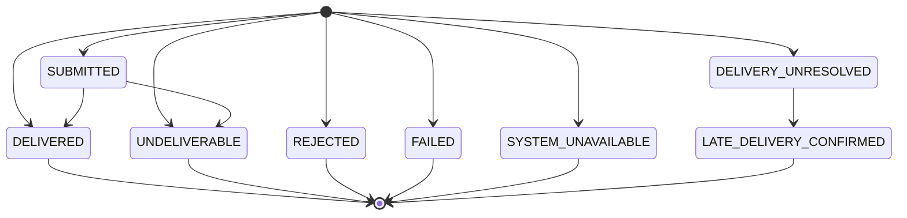
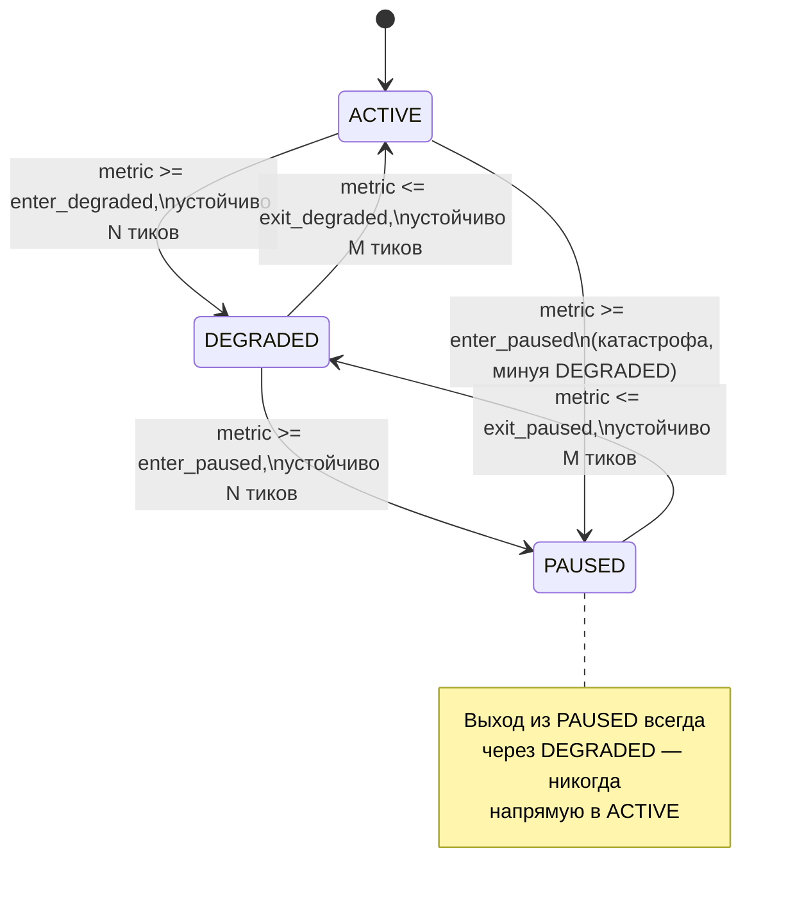
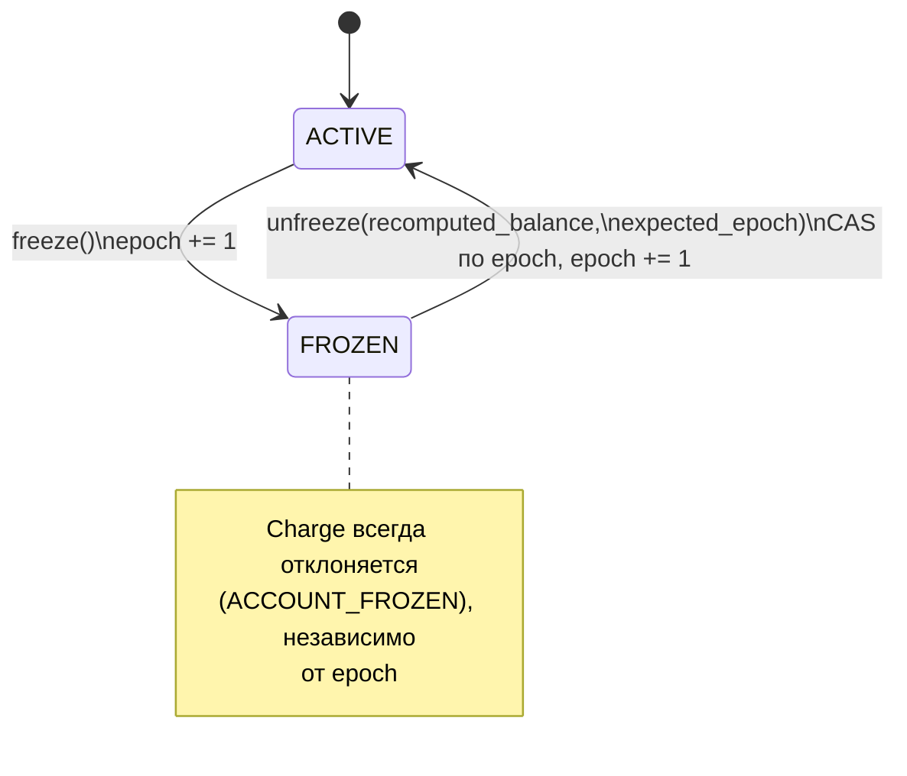

# State Machines — LLD

**Статус:** формализовано и провалидировано исполняемым кодом (Python), не только описано текстом. Исходники: `state_machines/*.py`, запускаются напрямую (`python3 state_machines/<file>.py`), каждый печатает список пройденных тестов.

Это LLD-документ для трёх переходных механизмов, которые раньше существовали только как текстовые упоминания в `hld.md` (§8.3, §10, §15.3/§15.5) и были явно отмечены в `platform_contracts.md` §4 как "не закрыто":

1. `message.lifecycle` — Message State Resolver
2. Execution Control — гистерезис ACTIVE/DEGRADED/PAUSED
3. Billing `account_state` — ACTIVE/FROZEN с fencing по `account_epoch`

Логика каждой машины состояний — это контракт, который должен быть перенесён 1:1 в production-код соответствующего сервиса (Java/Go), не переизобретён на месте.

---

## 1. Message Lifecycle (`MessageLifecycleStatus`)

**Владелец:** Message State Resolver (Java/Kafka Streams, `service_internal_methods.md` §2.4).
**Источник:** `state_machines/message_lifecycle.py` — 10/10 тестов.

### 1.1 Статусы

| Статус | Терминален? | Смысл |
|---|---|---|
| `SUBMITTED` | нет | Сообщение принято, ожидает исхода доставки |
| `DELIVERED` | да | Подтверждена доставка (DLR) |
| `UNDELIVERABLE` | да | Подтверждён отказ доставки |
| `DELIVERY_UNRESOLVED` | да* | DLR не получен в SLA-окно — исход неизвестен |
| `LATE_DELIVERY_CONFIRMED` | да | Поздний DLR пришёл после `DELIVERY_UNRESOLVED` |
| `REJECTED` | да | Policy отклонила сообщение до отправки оператору |
| `FAILED` | да | Внутренняя ошибка пайплайна |
| `SYSTEM_UNAVAILABLE` | да | Оператор/канал недоступен на момент попытки |

`*` `DELIVERY_UNRESOLVED` — единственный статус с исключением из терминальности (см. 1.3).

### 1.2 Диаграмма переходов



Прямых входов в `SUBMITTED` из `[*]`, кроме как через Pipeline Engine (реальный submit), нет — но диаграмма показывает допустимые *entry points* с точки зрения State Resolver, включая случаи, когда Reconciliation даёт первый статус напрямую, минуя `SUBMITTED` (см. 1.4).

### 1.3 Правила

- **Терминальное состояние отклоняет всё**, кроме явно перечисленных исключений. Единственное исключение во всей машине: `DELIVERY_UNRESOLVED → LATE_DELIVERY_CONFIRMED`.
- **Осознанно НЕ разрешено:** поздний DLR, противоречащий уже вынесенному `DELIVERED`/`UNDELIVERABLE` (например, оператор сначала прислал `DELIVERED`, затем через сутки — `UNDELIVERABLE` по той же попытке). Такое считается аномалией оператора, логируется в `reconciliation_cases`, но не переписывает lifecycle — history уже отдана партнёру, менять её задним числом хуже, чем зафиксировать расхождение отдельно.
- **Идемпотентность по `event_id`.** Повторная доставка того же Kafka-события (at-least-once) — no-op, не ошибка и не регрессия.
- **`lifecycle_version` инкрементируется на каждом успешно применённом переходе** — это то, что партнёр видит как версию в `message_read_model` (data_infrastructure_spec.md §1.3), и то, что защищает от out-of-order apply при параллельной обработке партиций.

### 1.4 Entry points, отличные от `SUBMITTED`

Reconciliation-поток (HLD §13) может дать статус напрямую, если `SUBMITTED` для данного сообщения никогда не был зафиксирован State Resolver-ом (например, событие подтверждения пришло раньше события отправки из-за перекоса партиций) — отсюда `DELIVERED`, `UNDELIVERABLE`, `DELIVERY_UNRESOLVED` в списке `VALID_ENTRY_POINTS`, наравне с `REJECTED`/`FAILED`/`SYSTEM_UNAVAILABLE` (которые всегда терминальны с рождения, `SUBMITTED` для них никогда не наступает).

---

## 2. Execution Control — гистерезис ACTIVE/DEGRADED/PAUSED

**Владелец:** Execution Control Service (Go, `services_specifictaion.md` §4.1).
**Источник:** `state_machines/execution_control_hysteresis.py` — 5/5 тестов.

### 2.1 Диаграмма



### 2.2 Параметры (per scope: GLOBAL/STAGE/PARTNER/PARTNER_STAGE/OPERATOR_ROUTE)

| Параметр | Назначение |
|---|---|
| `enter_degraded` / `exit_degraded` | Пороги метрики (ошибка/задержка) для входа/выхода DEGRADED |
| `enter_paused` / `exit_paused` | Пороги для PAUSED |
| `enter_confirmation_window_ticks` | Сколько тиков подряд метрика должна держать порог, чтобы **ухудшение** применилось |
| `exit_confirmation_window_ticks` | То же для **улучшения** — обычно больше, восстановление доверяется медленнее, чем деградация |
| `min_state_duration_ticks` | Минимальное время в состоянии до следующего перехода — второй, независимый анти-флаппинг барьер поверх confirmation window |

### 2.3 Доказанные свойства (тестами, не декларацией)

1. Шум вокруг порога (колебания ±0.05 вокруг `enter_degraded`) не вызывает ни одного перехода — `test_noise_around_threshold_does_not_flap`.
2. Устойчивая деградация идёт по лестнице `ACTIVE → DEGRADED → PAUSED`, никогда не перепрыгивая `DEGRADED` при постепенном ухудшении — `test_sustained_degradation_enters_degraded_then_paused`.
3. Восстановление из `PAUSED` останавливается в `DEGRADED`, даже если метрика уже полностью здорова (0.1, глубоко в зоне ACTIVE) — намеренная асимметрия: спуск может быть быстрым, подъём — всегда осторожный, в два прыжка — `test_recovery_from_paused_goes_through_degraded_not_straight_to_active`.
4. Катастрофический скачок метрики уходит из `ACTIVE` сразу в `PAUSED`, минуя `DEGRADED` — единственный разрешённый "прыжок через ступеньку", и только вниз — `test_active_can_jump_straight_to_paused_on_catastrophic_spike`.
5. `min_state_duration` блокирует немедленный повторный переход даже когда confirmation window уже выполнен на первом же тике после входа в состояние — `test_min_state_duration_blocks_immediate_re_transition`.

---

## 3. Billing `account_state` — ACTIVE/FROZEN с fencing

**Владелец:** Billing Redis (Lua/Redis Function, `services_specifictaion.md` §2.6), координируется Billing Reconciliation.
**Источник:** `state_machines/billing_account_state.py` — 8/8 тестов.

### 3.1 Диаграмма



### 3.2 Зачем нужен `account_epoch`

`account_epoch` — не аудиторская метка, а единственный механизм, которым `apply_atomic_charge` отличает "легитимную операцию текущего состояния" от "операции, прочитавшей состояние до того, как оно поменялось". Три независимые проверки в одном атомарном вызове (соответствует HLD §15.2):

```
apply_charge(account, charge_id, amount, expected_epoch):
    if charge_id уже применён      → ALREADY_PROCESSED   (идемпотентность at-least-once)
    if account.epoch != expected_epoch → STALE_EPOCH       (fencing)
    if account.state == FROZEN     → ACCOUNT_FROZEN
    иначе → списать, зафиксировать charge_id → APPLIED
```

Порядок проверок важен: `STALE_EPOCH` проверяется **до** `ACCOUNT_FROZEN`, потому что цель — отловить операцию, которая была легитимна в момент чтения epoch, но устарела к моменту записи, независимо от того, в каком состоянии счёт находится сейчас.

### 3.3 Fenced recovery (HLD §15.5), пошагово

1. **detect** — Reconciliation обнаруживает расхождение (баланс в Redis vs пересчёт по `billing_ledger`).
2. **classify** — решает, требует ли расхождение заморозки (порог, ниже которого можно просто залогировать и не морозить).
3. **alert** — уведомление on-call.
4. **freeze** — `account_state = FROZEN`, `account_epoch += 1`. С этого момента `apply_charge` отклоняет все операции с `ACCOUNT_FROZEN`, а операции, "зависшие в полёте" до freeze (уже прочитавшие старый epoch), отклоняются с `STALE_EPOCH`, даже если бы теоретически прошли по `account_state`.
5. **await outbox drain** — ждём, пока все уже отправленные-но-не-подтверждённые списания дойдут до `billing_ledger` (иначе recompute в следующем шаге будет неполным).
6. **recompute** — считаем `recomputed_balance` по `billing_ledger`, **запоминая `expected_epoch`, увиденный в начале пересчёта**.
7. **fenced CAS unfreeze** — `unfreeze(account, recomputed_balance, expected_epoch)`. Если пока считали, epoch уехал (кто-то ещё вмешался — повторный freeze, ручное вмешательство и т.п.), CAS отклоняется с ошибкой, recovery обязан начать пересчёт заново, а не применить устаревший баланс поверх текущего состояния.
8. **unfreeze success** — `account_state = ACTIVE`, `account_epoch += 1`, баланс заменяется на `recomputed_balance`.
9. **audit trail** — весь цикл пишется в `execution_control_audit`/`billing_ledger` compensating-записями, где применимо.

### 3.4 Доказанные свойства

1. Обычное списание и идемпотентность по `charge_id` работают как в billing_ledger (`ON CONFLICT DO NOTHING` в DDL — тот же принцип на уровне Redis) — `test_normal_charge_applies`, `test_duplicate_charge_id_is_idempotent`.
2. Списание отклоняется, пока счёт заморожен — `test_charge_rejected_while_frozen`.
3. **Ключевое свойство fencing**: операция, прочитавшая `epoch=0` до freeze, но применяющаяся после (`epoch=1`), отклоняется по `STALE_EPOCH`, а не списывает деньги с только что замороженного счёта — `test_in_flight_charge_rejected_by_stale_epoch_race`.
4. `freeze()` идемпотентен — повторный freeze уже замороженного счёта не двигает epoch дальше (иначе конкурентные детекторы расхождения могли бы разъезжаться в epoch без причины) — `test_freeze_is_idempotent_does_not_double_bump_epoch`.
5. Успешный fenced unfreeze применяет пересчитанный баланс и продвигает epoch — `test_fenced_unfreeze_success_path`.
6. Unfreeze с устаревшим `expected_epoch` (кто-то заморозил/разморозил счёт снова, пока считался recompute) отклоняется, не затирая более новое состояние — `test_fenced_unfreeze_rejects_if_epoch_moved_during_recompute`.
7. После успешного recovery операции с новым epoch проходят нормально — `test_charge_after_successful_unfreeze_uses_new_epoch`.

---

## 4. Как это соотносится с остальными LLD-документами

| Машина состояний | Формализована здесь | Production-исполнитель | Проверено против |
|---|---|---|---|
| `message.lifecycle` | §1 | Message State Resolver (Java/Kafka Streams) | `message_lifecycle_history` (V005), `message_read_model` (V004) |
| Execution Control hysteresis | §2 | Execution Control Service (Go) | `execution_control_audit` (V016) |
| Billing `account_state` | §3 | Billing Redis Lua/Redis Function | `billing_ledger` (V008), CHECK-constraints на compensating-записи |

Все три файла в `state_machines/` запускаются без зависимостей (`python3 state_machines/<file>.py`), печатают список тестов и итог — это исполняемая спецификация, не только описание.


